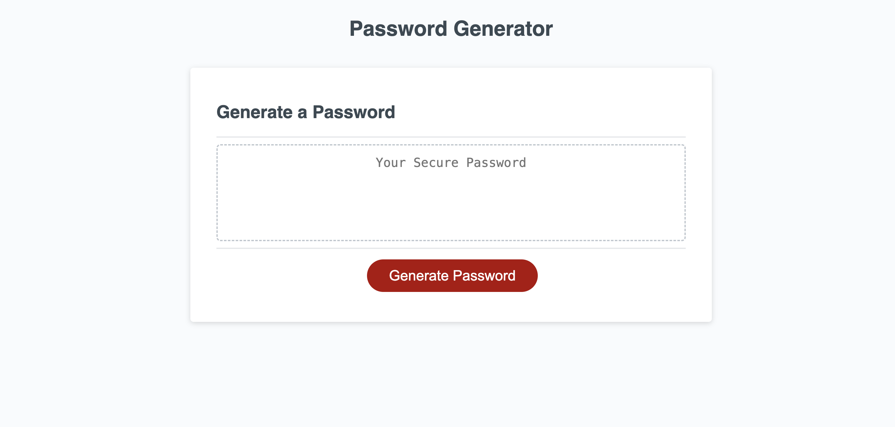

# Password Generator

A simple web application that can generate a secure password. It can generate passwords which contain any combination of lowercase, uppercase, numeric, or special characters. 

## Deployment

[Click here](https://jkp1990.github.io/Module-5-Password-Generator/)

## Usage

Click the button, then answer the prompts. Your password will appear in the text box above the button. Then, just copy and paste.

